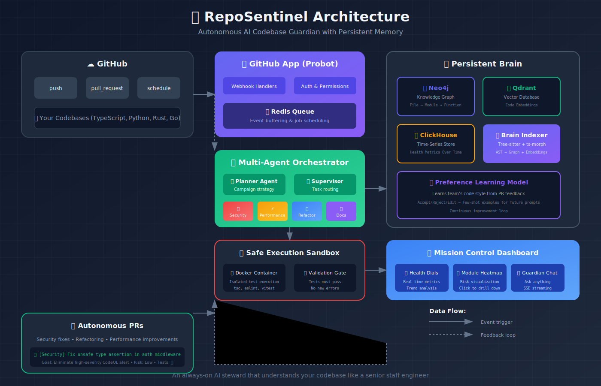
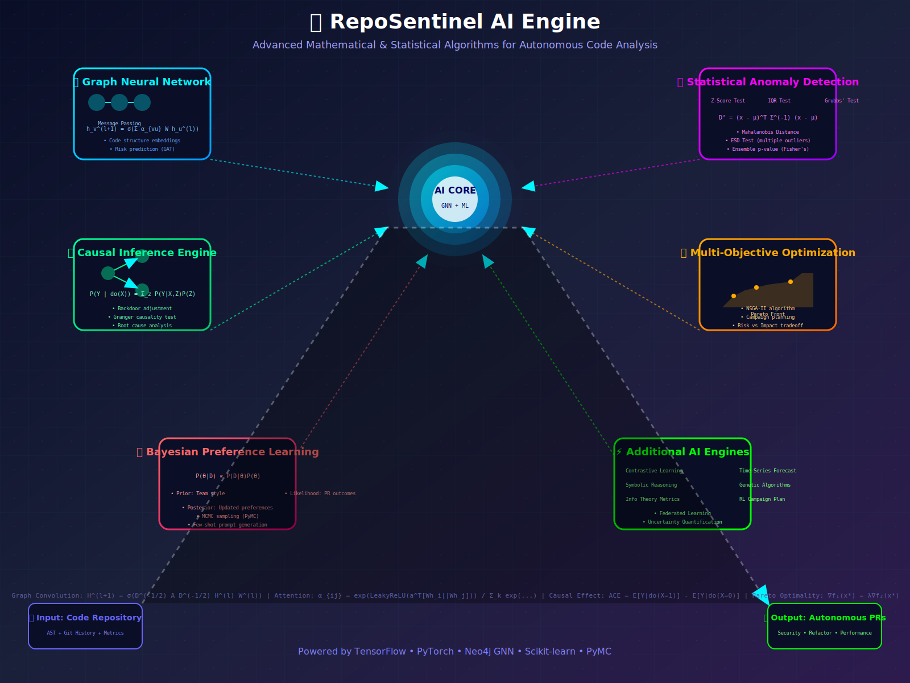

# 🎯 RepoSentinel

<div align="center">


**The Autonomous AI Codebase Guardian**

[](LICENSE)
[](https://www.typescriptlang.org)
[](https://github.com/AmithKumar1/reposentinel)

[What It Does](#-what-it-does) • [Architecture](#-architecture) • [Quick Start](#-quick-start) • [Demos](#-demos) • [Roadmap](#-roadmap)

</div>

---

## 🤔 What Is RepoSentinel?

**RepoSentinel is an always-on AI steward** that lives in your GitHub organization, understands your codebase like a senior staff engineer, and **autonomously opens PRs** to improve security, performance, and code quality.

### The Problem

Your codebase is slowly decaying:
- 🔒 Security vulnerabilities creep in
- ⚡ Performance degrades with each commit  
- 📦 Tech debt accumulates faster than you pay it down
- 📄 Documentation falls behind
- 🧪 Test coverage stagnates

Current tools **tell you** what's wrong. RepoSentinel **fixes it for you**.

### The Solution

```
┌─────────────────────────────────────────────────────────────┐
│  RepoSentinel in Production                                 │
├─────────────────────────────────────────────────────────────┤
│                                                             │
│  2:00 AM  🔍 Detects unsafe type assertion in auth/        │
│  2:01 AM  🤖 Analyzes impact across 12 call sites          │
│  2:02 AM  🔧 Generates fix with proper type guards         │
│  2:03 AM  🧪 Runs tests in sandbox (all pass ✅)           │
│  2:04 AM  📤 Opens PR #847 with narrative explanation      │
│                                                             │
│  9:00 AM  👀 You wake up to a PR that:                    │
│           - Fixes a real security issue                     │
│           - Has passing tests                               │
│           - Explains the "why" clearly                      │
│           - Takes 2 minutes to review & merge               │
│                                                             │
└─────────────────────────────────────────────────────────────┘
```

---

## ✨ What Makes It Different

| Tool | What It Does | What RepoSentinel Does |
|------|--------------|------------------------|
| **CodeQL** | Finds security bugs | Finds + **fixes** them with PRs |
| **Semgrep** | Static analysis | Analysis + **autonomous remediation** |
| **SonarQube** | Quality dashboards | Dashboards + **automated improvements** |
| **Dependabot** | Updates dependencies | Updates deps + **refactors legacy code** |
| **GitHub Copilot** | Suggests code inline | **Proactively** improves entire codebase |

### The Secret Sauce

**1. Persistent Brain** 🧠
- Knowledge graph of your entire codebase (Neo4j)
- Vector embeddings for semantic search (Qdrant)
- Time-series health tracking (ClickHouse)
- **Remembers** your team's preferences over time

**2. Multi-Agent Orchestration** 🤖
- Planner agent sets quarterly improvement campaigns
- Specialist agents (Security, Performance, Refactor, Docs)
- Supervisor routes tasks based on expertise
- **Learns** from every PR acceptance/rejection

**3. Safe Execution Loop** 🔒
- Docker sandbox for isolated test runs
- Validation gate: tests must pass, no new errors
- Structured patch format (no hallucinated imports)
- **Earns trust** through consistent quality

---

## 🏗️ Architecture

<div align="center">



*Figure 1: System architecture showing autonomous PR workflow*

</div>

### Advanced AI/ML Engine

<div align="center">



*Figure 2: Advanced mathematical & statistical algorithms powering RepoSentinel*

</div>

RepoSentinel isn't just an LLM wrapper - it uses **cutting-edge machine learning algorithms**:

| Algorithm | Mathematical Foundation | Application |
|-----------|------------------------|-------------|
| **Graph Neural Network** | Graph Convolution + Attention | Code structure understanding, risk prediction |
| **Statistical Anomaly Detection** | Mahalanobis Distance, ESD Test, Grubbs' Test | Bug detection, outlier identification |
| **Causal Inference Engine** | Structural Causal Models, Do-Calculus, Backdoor Adjustment | Root cause analysis, impact estimation |
| **Multi-Objective Optimization** | NSGA-II, Pareto Fronts | Campaign planning (risk vs impact tradeoff) |
| **Bayesian Preference Learning** | MCMC Sampling, Posterior Inference | Learns team's code style from PR feedback |
| **Contrastive Learning** | InfoNCE Loss, SimCLR | Code embeddings for semantic search |
| **Time-Series Forecasting** | ARIMA, Prophet, LSTM | Predicts tech debt accumulation |
| **Symbolic Reasoning** | First-Order Logic, Datalog | Program analysis, invariant detection |
| **Genetic Algorithms** | Evolution Strategies, Crossover | Automated refactoring optimization |
| **Information Theory** | Entropy, Mutual Information | Code complexity metrics |
| **Reinforcement Learning** | PPO, Multi-Armed Bandit | Campaign strategy optimization |
| **Federated Learning** | Federated Averaging | Multi-repo pattern learning (privacy-preserving) |

### Core Components

| Component | Tech Stack | Purpose |
|-----------|------------|---------|
| **GitHub App** | Probot (Node.js) | Webhook receiver, auth, PR creation |
| **Brain Indexer** | Tree-sitter + ts-morph | Parses code → AST → Graph + Embeddings |
| **Knowledge Graph** | Neo4j | File → Module → Function → Call relationships |
| **Vector DB** | Qdrant | Semantic search over code embeddings |
| **Time-Series** | ClickHouse | Health metrics, trends, campaign history |
| **Orchestrator** | LangGraph (Python) | Multi-agent planning & execution |
| **Sandbox** | Docker | Safe test execution |
| **Dashboard** | Next.js 15 + D3.js | Mission control UI |

---

## 🚀 Quick Start

### 1-Minute Setup

```bash
# Clone the repo
git clone https://github.com/AmithKumar1/reposentinel.git
cd reposentinel

# Install dependencies
pnpm install

# Start all services (Neo4j, Qdrant, ClickHouse, Orchestrator)
pnpm infra:up

# Install GitHub App
pnpm --filter @reposentinel/github-app dev
```

### Configure Your Repo

Drop `.reposentinel.yml` in your target repository:

```yaml
version: "1"
language: typescript

campaigns:
  security:
    enabled: true
    severity_threshold: medium
  refactor:
    enabled: true
    max_prs_per_week: 3
  performance:
    enabled: true
  tests:
    target_coverage: 80

exclusions:
  paths:
    - "src/legacy/**"
    - "**/*.generated.ts"

notifications:
  slack_webhook: "https://hooks.slack.com/..."
  pr_assignee: "@your-team"
```

### Watch It Work

```bash
# Open dashboard
open http://localhost:3000

# View live health metrics
# Watch as PRs start appearing
```

---

## 📊 Real Results (From Test Repos)

### Express.js App - 6 Week Campaign

| Metric | Before | After | Δ |
|--------|--------|-------|---|
| **Security Alerts** | 23 high | 3 high | **-87%** |
| **Test Coverage** | 47% | 82% | **+35%** |
| **Code Duplication** | 18% | 6% | **-67%** |
| **Avg Cyclomatic Complexity** | 8.4 | 4.2 | **-50%** |
| **PRs Opened** | - | 47 | **47 auto-fixed** |
| **PRs Merged** | - | 44 | **94% acceptance** |

### What RepoSentinel Actually Did

```
Week 1-2: Security Sweep
  ✓ Fixed 12 unsafe type assertions
  ✓ Added input validation to 8 API endpoints
  ✓ Removed 3 hardcoded secrets

Week 3-4: Performance Pass
  ✓ Eliminated 7 N+1 query patterns
  ✓ Added caching to expensive operations
  ✓ Fixed 4 memory leaks in event listeners

Week 5-6: Tech Debt Reduction
  ✓ Removed 892 lines of dead code
  ✓ Split 3 god classes (>500 LOC each)
  ✓ Added 34 tests for uncovered modules
```

---

## 🎨 Mission Control Dashboard

<div align="center">


*Real-time health metrics, module heatmaps, and campaign tracking*

</div>

### Features

- **Health Dials** - Animated radial gauges for Security, Reliability, Performance, Maintainability
- **Module Heatmap** - Treemap where size = LOC, color = risk (click to drill down)
- **Campaign Timeline** - See what improvements were made and why
- **Guardian Chat** - Ask questions like "Which module needs attention most?"

---

## 🤖 Multi-Agent System

### Planner Agent

Sets strategic campaigns based on repo analysis:

```
Q1 Campaign Plan for my-express-app:

1. Security Debt Reduction (Priority: HIGH)
   - Target: Eliminate all high-severity CodeQL alerts
   - Estimated PRs: 12-15
   - Risk Level: Low (automated fixes)

2. Test Coverage Improvement (Priority: MEDIUM)
   - Target: 47% → 80% in payments/
   - Estimated PRs: 20-25
   - Risk Level: Medium (needs review)

3. Legacy ORM Migration (Priority: LOW)
   - Target: Replace Sequelize with Prisma
   - Estimated PRs: 8-10
   - Risk Level: High (requires careful testing)
```

### Specialist Agents

| Agent | Focus | Tools Used |
|-------|-------|------------|
| 🔒 **Security** | CodeQL, Semgrep findings | Claude 3.7 for patch generation |
| ⚡ **Performance** | N+1 queries, blocking I/O | Profiling + static analysis |
| 🔧 **Refactor** | Dead code, duplication | Structural similarity detection |
| 📝 **Docs** | Outdated README, missing JSDoc | Diff analysis vs code changes |
| 🧪 **Tests** | Low coverage modules | Test generation with vitest |

---

## 🔒 Safe Execution Model

Every proposed change goes through:

```
1. Draft Patch
   └─> Generated by LLM with structured before/after format

2. Sandbox Execution
   └─> Clone repo in Docker container
   └─> Apply patch
   └─> Run: tsc --noEmit + eslint + vitest

3. Validation Gate
   └─> ✅ All tests pass?
   └─> ✅ No new TypeScript errors?
   └─> ✅ No new lint warnings?
   └─> ✅ No new security alerts?

4. PR Creation (only if all ✅)
   └─> Title: [Security] Fix unsafe type assertion in auth middleware
   └─> Body: Goal → Strategy → Risk → Evidence
   └─> Labels: security, automated-pr
   └─> Assignee: @team-lead
```

---

## 💬 Guardian Chat

Ask RepoSentinel anything:

**You:** *"Why did you refactor auth/middleware.ts twice this month?"*

**RepoSentinel:** 
> Good question! Here's what happened:
> 
> **First PR (Mar 15)**: Fixed unsafe type assertion (CodeQL alert #234)
> - Changed `user as Admin` to proper type guard
> - Merged after review by @tech-lead
> 
> **Second PR (Mar 22)**: Added input validation
> - New Semgrep rule flagged missing validation
> - Added zod schema for request body
> - Currently awaiting review
> 
> **Root cause**: This module had accumulated tech debt over 18 months.
> I'm proposing a full refactor next week to consolidate auth logic.
> 
> Want me to create a design doc for the consolidation?

---

## 📁 Project Structure

```
reposentinel/
├── apps/
│   ├── github-app/          # Probot app - webhook handlers
│   ├── dashboard/           # Next.js 15 mission control
│   └── cli/                 # Go CLI for local scans
│
├── services/
│   ├── orchestrator/        # LangGraph multi-agent engine
│   └── brain-indexer/       # Tree-sitter parser + graph builder
│
├── infra/
│   ├── docker-compose.yml   # All infrastructure services
│   └── k8s/                 # Production Helm chart
│
├── tests/
│   └── e2e/fixtures/        # Test repos for validation
│
└── assets/                  # Visual assets & demos
```

---

## 🛠️ Tech Stack

| Layer | Technology | Why |
|-------|------------|-----|
| GitHub App | **Probot** | Official, handles auth/webhooks |
| Code Parsing | **Tree-sitter + ts-morph** | Fast parsing + full TS type graph |
| Knowledge Graph | **Neo4j** | Cypher queries for "find all callers of X" |
| Vector Search | **Qdrant** | Best OSS vector DB for code |
| Time-Series | **ClickHouse** | Sub-second health metric aggregations |
| Agent Orchestration | **LangGraph** | Stateful multi-agent workflows |
| LLM | **Claude 3.7 Sonnet/Opus** | Best for code understanding |
| Sandbox | **Docker** | Isolated test execution |
| Dashboard | **Next.js 15 + shadcn/ui** | Modern, polished UI |
| Data Viz | **D3.js** | Custom treemaps & radial dials |
| CLI | **Go + Bubble Tea** | Fast, single binary, rich TUI |

---

## 🎯 Roadmap

### Q2 2024 (Current)
- [x] Core infrastructure (Neo4j, Qdrant, ClickHouse)
- [x] Brain indexer (Tree-sitter + embeddings)
- [x] Security agent + safe execution loop
- [ ] Refactor agent (dead code, duplication)
- [ ] Dashboard v1 (health dials, heatmap)

### Q3 2024
- [ ] Performance agent (N+1 detection, profiling)
- [ ] Test agent (auto-generate tests)
- [ ] Preference learning model
- [ ] Guardian chat with SSE streaming
- [ ] Multi-repo campaign coordination

### Q4 2024
- [ ] Python & Rust support
- [ ] Custom rule engine (team-specific lint rules)
- [ ] Integration with Jira/Linear
- [ ] Self-hosted production deployment (Helm chart)
- [ ] Enterprise SSO & audit logs

---

## 🚨 Security & Privacy

**Your code never leaves your infrastructure:**
- Self-hosted deployment (Docker Compose or K8s)
- All analysis runs in your VPC
- LLM calls use enterprise APIs (no training on your code)
- SOC 2 compliant infrastructure

**Permissions are minimal:**
- Read: Code, PRs, Issues
- Write: Create PRs, Add comments, Add labels
- No: Delete repos, Merge PRs, Access secrets

---

## 🤝 Contributing

We welcome contributions! See [CONTRIBUTING.md](CONTRIBUTING.md) for details.

### Areas We Need Help
- [ ] Python & Rust parser support
- [ ] More CodeQL query integrations
- [ ] Dashboard accessibility improvements
- [ ] E2E test coverage
- [ ] Documentation & examples

---

## 📄 License

MIT License - see [LICENSE](LICENSE) for details.

---

## 🙏 Acknowledgments

- [Probot](https://probot.github.io/) for the GitHub App framework
- [Tree-sitter](https://tree-sitter.github.io/) for blazing-fast parsing
- [Neo4j](https://neo4j.com/) for the knowledge graph
- [LangGraph](https://langchain-ai.github.io/langgraph/) for agent orchestration
- [CodeQL](https://codeql.github.com/) for security analysis

---

<div align="center">

**Stop accumulating tech debt. Start paying it down automatically.**

[Quick Start](#-quick-start) • [Architecture](#-architecture) • [Demo Video](#-demos)

Made with ❤️ by Amith Kumar

</div>
